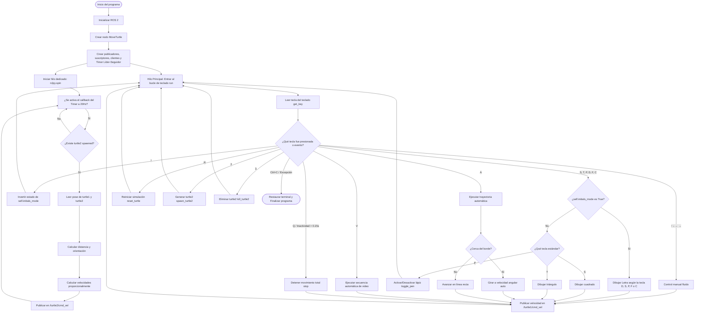

<div align="center">
<picture>
    <source srcset="https://imgur.com/5bYAzsb.png" media="(prefers-color-scheme: dark)">
    <source srcset="https://imgur.com/Os03JoE.png" media="(prefers-color-scheme: light)">
    
</picture>

<h3>Curso de Robótica 2026-I</h3>
<h1>Laboratorio No. 04</h1>
<h2>Robótica de Desarrollo, Intro a ROS 2 Jazzy Jalisco - Turtlesim</h2>
<h4>Profesores: Pedro Fabián Cárdenas Herrera · Manuel Felipe Carranza Montenegro</h4>
<h4>Estudiantes: David Felipe Cárdenas Cubides · David Santiago Pirateque Suárez </h4>

<p>
  
  
  
  
</p>

<br>
<br>
<b>Figura 1. Robot Operating System.</b>
</div>


# Laboratorio 04: Control y Arquitectura en ROS 2 Jazzy (Turtlesim)

## 1. Objetivos

### Objetivo General
Implementar un paquete de ROS 2 Jazzy Jalisco que permita controlar de una a dos tortugas en el simulador Turtlesim mediante un nodo programado en Python. Este desarrollo debe incluir funciones para control manual, trayectorias automáticas, dibujo de figuras geométricas y tipográficas, y un sistema de control líder-seguidor. 

### Objetivos Específicos
- Comprender la arquitectura fundamental de ROS 2.
- Implementar nodos personalizados.
- Controlar y gestionar el entorno de Turtlesim.
- Implementar comunicación mediante tópicos (publicadores/suscriptores) y servicios (clientes/servidores).
- Desarrollar y sintonizar un sistema de seguimiento (líder-seguidor).

## 2. Introducción

El presente laboratorio tiene como objetivo principal desarrollar una aplicación en ROS 2 que permita controlar el movimiento de una tortuga dentro del simulador Turtlesim, aplicando los conceptos fundamentales de programación de nodos en Python y la comunicación entre ellos. A lo largo del desarrollo, se implementaron múltiples funciones que permiten interactuar con el simulador de forma manual y automática.

La solución fue desplegada en Ubuntu 24.04 LTS utilizando ROS 2 Jazzy Jalisco, Python y la librería `rclpy`. Entre las principales funcionalidades desarrolladas se destacan: el control fluido y simultáneo mediante el teclado, la generación automática de trayectorias (cuadrados y triángulos), el trazado de las letras correspondientes a las iniciales de los integrantes del grupo (D, F, C, P, S) empleando cinemática de lazo cerrado, la gestión del lápiz de dibujo, el reinicio seguro de las variables, y la instanciación de un sistema líder-seguidor donde una segunda tortuga persigue a la principal analizando los datos compartidos a través de los tópicos de ROS 2.

## 3. Tecnologías Usadas

<br>
<div align="center">

| Tecnología | Versión | Descripción |
| :--- | :--- | :--- |
| **Ubuntu** | 24.04 LTS | Sistema operativo base donde se instaló y ejecutó el entorno de desarrollo ROS 2. |
| **ROS 2**| Jazzy Jalisco | Framework utilizado para el desarrollo de la aplicación robótica basada en nodos, tópicos y servicios. |
| **Python**| 3.9+ | Lenguaje de programación utilizado para implementar la lógica de control. |
| **rclpy**| ROS 2 | Biblioteca oficial de Python para la creación de nodos, publicadores, suscriptores y clientes. |
| **Turtlesim** | ROS 2 | Simulador bidimensional utilizado para visualizar y validar el movimiento cinemático. |
| **Git/GitHub** | Web | Sistema de control de versiones donde se almacena y documenta el repositorio. |
| **VirtualBox** | 7.2.8 | Software de virtualización donde se instaló la máquina virtual con Ubuntu. |

</div>
<br>

## 4. Estructura del Proyecto

El desarrollo del laboratorio se encapsuló dentro de un paquete denominado **`my_turtle_controller`**, ubicado en el espacio de trabajo (*workspace*) de ROS 2. Este paquete contiene el nodo principal y las configuraciones necesarias para su correcta ejecución. Su estructura es la siguiente:

```text
~/ros2_jazzy/src/
└── my_turtle_controller/
    ├── package.xml
    ├── setup.py
    ├── setup.cfg
    ├── resource/
    │   └── my_turtle_controller
    ├── my_turtle_controller/
    │   ├── __init__.py
    │   └── move_turtle.py
    └── test/
```

El script principal es `move_turtle.py`, el cual concentra la lógica del laboratorio, abarcando:
* Máquina de estados para control manual concurrente.
* Algoritmos de figuras geométricas automáticas.
* Cinemática con curvas para dibujo de letras tipográficas.
* Lógica de control proporcional para el modo líder-seguidor.

Para habilitar la ejecución, se modificó el archivo `setup.py` registrando el nodo ejecutable:
```python
entry_points={
    'console_scripts': [
        'move_turtle = my_turtle_controller.move_turtle:main',
    ],
},
```
Finalmente, las dependencias (`rclpy`, `turtlesim`, `geometry_msgs`, `std_srvs`) fueron declaradas formalmente en el archivo `package.xml`.

## 5. Diagrama de Flujo



## 6. Arquitectura del Paquete

El paquete implementado orbita en torno al nodo `move_turtle_node`. Este nodo centraliza el procesamiento de entradas del usuario, cálculos cinemáticos y la gestión general del entorno, apoyándose en la infraestructura del middleware de ROS 2 para comunicarse con el simulador.

<br>
<div align="center">
  
  <br>
  <b>Figura 2. Diagrama de arquitectura de programación.</b>
</div>
<br>

El simulador (`turtlesim_node`) opera como el actuador y sensor virtual, encargado de:
* Renderizar gráficamente las tortugas.
* Recibir y aplicar comandos de velocidad espacial.
* Actualizar la física y calcular la odometría.
* Publicar la pose actual a alta frecuencia.

Nuestra arquitectura utiliza **dos publicadores** (`/turtle1/cmd_vel` y `/turtle2/cmd_vel`) para el envío de instrucciones de velocidad lineal y angular. A su vez, requiere **dos suscriptores** (`/turtle1/pose` y `/turtle2/pose`) para realimentar el sistema con la posición exacta y lograr el control de lazo cerrado necesario para las figuras y el seguimiento.

## 7. implementación

La solución integral reside en el script `move_turtle.py`, cumpliendo con la restricción del laboratorio de gestionar todo el movimiento exclusivamente desde nodos propios, sin recurrir a paquetes externos como `turtle_teleop_key`.

### 7.1 Creacion de nodo, suscrptores y publicadores.

El programa se inicializa heredando de la clase `Node` de la biblioteca `rclpy`. En su constructor, se instancian los elementos básicos para el funcionamiento del nodo.

```python

class MoveTurtle(Node):

    def __init__(self):
        super().__init__('move_turtle_node')

```

Posteriormente, se configuran los publicadores para enviar objetos de tipo `Twist` (comandos de velocidad) y los suscriptores para recibir objetos de tipo `Pose` (posición actual). 

```python

self.cmd_vel_pub = self.create_publisher(
    Twist,
    '/turtle1/cmd_vel',
    10
)

self.pose_sub = self.create_subscription(
    Pose,
    '/turtle1/pose',
    self.pose_callback,
    10
)

```

Adicionalmente, se instancian un publicador y un suscriptor exclusivos para gestionar la comunicación del sistema líder-seguidor.

```python

self.cmd_vel2_pub = self.create_publisher(
    Twist,
    '/turtle2/cmd_vel',
    10
)

self.pose2_sub = self.create_subscription(
    Pose,
    '/turtle2/pose',
    self.pose2_callback,
    10
)

```
### 7.2 Creación de clientes de servicios.

Para la ejecución de tareas síncronas que modifican el entorno, se implementaron clientes apuntando a los servicios nativos provistos por el simulador `turtlesim`.

```python

self.teleport_client = self.create_client(
    TeleportAbsolute,
    '/turtle1/teleport_absolute'
)

self.set_pen_client = self.create_client(
    SetPen,
    '/turtle1/set_pen'
)

self.spawn_client = self.create_client(
    Spawn,
    '/spawn'
)

self.kill_client = self.create_client(
    Kill,
    '/kill'
)

```

### 7.3 Control manual.

Usando la función `get_key()`, se realiza una lectura directa y no bloqueante del teclado mediante las librerías `sys` y `select`.

```python

if key == KEY_UP:
    self.move_forward(now)

elif key == KEY_DOWN:
    self.move_backward(now)

elif key == KEY_LEFT:
    self.turn_left(now)

elif key == KEY_RIGHT:
    self.turn_right(now)

```
Para lograr un movimiento simultáneo y natural (acelerar y girar al mismo tiempo), se implementaron filtros temporales (*Watchdog Timers*). Estos almacenan de forma independiente la velocidad lineal y angular, manteniéndolas activas mientras se presionan las teclas y publicando los mensajes `Twist` sobre el tópico correspondiente. Al detectar inactividad, se aplica un frenado suave.

```python
def move_forward(self, now):
    self.current_v = LINEAR_SPEED
    self.last_v_time = now
    if self.current_w != 0.0: 
        self.last_w_time = now # Cross-Refresh para prevenir detenciones bruscas

```
### 7.4 Figuras automaticas.

Para el trazado de figuras, se implementó control cinemático de lazo cerrado mediante la lectura constante de la odometría, lo que garantiza vértices precisos. 

Para el triángulo, se itera un ciclo de tres movimientos rectos y giros calculados:

```python

    def draw_triangle(self, side_length=SHAPE_SIDE_LENGTH):
        self.get_logger().info('Dibujando triangulo...')
        for lado in range(3):
            if not self.move_by_distance(side_length): return
            if not self.turn_by_angle(2 * math.pi / 3): return
        self.get_logger().info('Triangulo completado.')

```

Obteniendo como resultado:

<br>

<div align="center">
  
  <br>
  <b>Figura 3. Figura de triángulo.</b>
</div>

<br>

Para el cuadrado, el procedimiento es análogo, iterando el movimiento 4 veces con giros ortogonales:

```python

    def draw_square(self, side_length=SHAPE_SIDE_LENGTH):
        self.get_logger().info('Dibujando cuadrado...')
        for lado in range(4):
            if not self.move_by_distance(side_length): return
            if not self.turn_by_angle(math.pi / 2): return
        self.get_logger().info('Cuadrado completado.')

```
Obteniendo como resultado:

<br>

<div align="center">
  
  <br>
  <b>Figura 4. Figura de rectángulo.</b>
</div>

<br>


### 7.5 Dibujo de letras.

Para el diseño de las iniciales (D, S, P, F, C), se implementó una rutina algorítmica independiente para cada una. Se desarrolló la función `draw_arc` equipada con reducción proporcional de velocidad (`SLOWDOWN_FACTOR`) al acercarse al ángulo objetivo. Esto evita la inercia excesiva ("overshoot") del simulador, garantizando que las curvas tipográficas se tracen con precisión.

```python 

    def draw_D(self):
        self.get_logger().info('Dibujando letra D...')
        self._set_pen(False) 
        if not self.turn_to_angle(math.pi / 2): return       
        if not self.move_by_distance(2.0): return            
        if not self.turn_to_angle(0.0): return               
        if not self.draw_arc(-math.pi, radius=1.0): return   
        self._set_pen(True)  
        self.turn_to_angle(0.0)

    def draw_S(self):
        self.get_logger().info('Dibujando letra S...')
        self._set_pen(False) 
        if not self.turn_to_angle(math.pi / 2): return               
        if not self.draw_arc(1.5 * math.pi, radius=0.5): return    
        if not self.turn_to_angle(0.0): return           
        if not self.draw_arc(-1.5 * math.pi, radius=0.5): return   
        self._set_pen(True)  
        self.turn_to_angle(0.0) 

    def draw_P(self):
        self.get_logger().info('Dibujando letra P...')
        self._set_pen(False) 
        if not self.turn_to_angle(math.pi / 2): return       
        if not self.move_by_distance(2.0): return            
        if not self.turn_to_angle(0.0): return               
        if not self.draw_arc(-math.pi, radius=0.65): return   
        self._set_pen(True)  
        self.turn_to_angle(0.0)

    def draw_F(self):
        self.get_logger().info('Dibujando letra F...')
        self._set_pen(False) 
        if not self.turn_to_angle(math.pi / 2): return       
        if not self.move_by_distance(2.0): return            
        if not self.turn_to_angle(0.0): return               
        if not self.move_by_distance(1.0): return            
        
        self._set_pen(True)  
        if not self.turn_to_angle(math.pi): return           
        if not self.move_by_distance(1.0): return            
        if not self.turn_to_angle(-math.pi / 2): return      
        if not self.move_by_distance(1.0): return            
        if not self.turn_to_angle(0.0): return               
        
        self._set_pen(False) 
        if not self.move_by_distance(0.8): return            
        self._set_pen(True)  
        self.turn_to_angle(0.0)

    def draw_C(self):
        self.get_logger().info('Dibujando letra C...')
        self._set_pen(True)  
        if not self.turn_to_angle(math.pi / 2): return       
        if not self.move_by_distance(2.0): return
        if not self.turn_to_angle(0.0): return               
        if not self.move_by_distance(1.0): return
        if not self.turn_to_angle(math.pi): return           
        
        self._set_pen(False) 
        if not self.draw_arc(math.pi, radius=1.0): return    
        self._set_pen(True)  
        self.turn_to_angle(0.0)
```

Al presionar la tecla `V`, se dispara una secuencia automática que posiciona el actuador y dibuja todas las letras en un arreglo de cuadrícula, manejando el levantamiento automático del lápiz para evitar trazos superpuestos.

<br>

<div align="center">
  
  <br>
  <b>Figura 5. Dibujo de letras.</b>
</div>

<br>

### 7.6 Sistema líder-seguidor.

El seguimiento se resuelve mediante la implementación de un controlador proporcional. Un temporizador calcula la diferencia matemática entre las coordenadas de ambas tortugas a una frecuencia de 20Hz.

```python
dx = self.current_pose.x - self.pose2.x
dy = self.current_pose.y - self.pose2.y

distance = math.hypot(dx, dy)

target_theta = math.atan2(dy, dx)
```
Se aplica la ganancia proporcional para generar las velocidades correctoras en función del error espacial y angular.

```python
msg.linear.x = 1.5 * distance

msg.angular.z = 6.0 * error_theta

```
Finalmente, la velocidad resultante es publicada y enviada al tópico correspondiente.

```python
self.cmd_vel2_pub.publish(msg)

```
Al presionar la tecla de activación del seguidor (`2`), se instancía una segunda tortuga mediante el servicio respectivo. Esta comienza a seguir automáticamente la trayectoria del líder. Su recorrido se representa con un trazo de color ligeramente distinto en el simulador.


<br>

<div align="center">
  
  <br>
  <b>Figura 6. Sistema Líder-seguidor.</b>
</div>

<br>

## 8. Verificación de la Arquitectura ROS 2

Durante la ejecución, se procedió a inspeccionar el sistema utilizando las herramientas de terminal que provee ROS 2 para confirmar la correcta comunicación entre componentes. A continuación, se detalla la evidencia:

*(Añade debajo de cada numeral la captura de pantalla de la terminal correspondiente)*

### 8.1 `ros2 node list`
**[AÑADE TU CAPTURA DE PANTALLA AQUÍ]**
> **Análisis:** Este comando lista los nodos activos. La captura demuestra que tanto `/turtlesim` como nuestro `/move_turtle_node` están operando simultáneamente en el middleware.

### 8.2 `ros2 topic list`
**[AÑADE TU CAPTURA DE PANTALLA AQUÍ]**
> **Análisis:** Despliega todos los canales de comunicación activos. Permite visualizar que la red cuenta con los tópicos de control cinemático y odometría para ambas tortugas (`/turtle1/cmd_vel`, `/turtle2/pose`, etc.).

### 8.3 `ros2 topic echo /turtle1/pose`
**[AÑADE TU CAPTURA DE PANTALLA AQUÍ]**
> **Análisis:** Permite monitorear el flujo de datos en tiempo real. En la captura se observa el mensaje `Pose` actualizándose con las coordenadas espaciales ($x, y, \theta$) que nuestro código procesa en el lazo cerrado.

### 8.4 `ros2 topic info /turtle1/cmd_vel`
**[AÑADE TU CAPTURA DE PANTALLA AQUÍ]**
> **Análisis:** Entrega metadatos vitales del tópico. Confirma el tipo de mensaje esperado (`geometry_msgs/msg/Twist`) y valida que existe 1 *Publisher* (nuestro script) y 1 *Subscriber* (el simulador).

### 8.5 `ros2 service list`
**[AÑADE TU CAPTURA DE PANTALLA AQUÍ]**
> **Análisis:** Muestra todos los servicios síncronos disponibles. Aquí se evidencian los servicios nativos que invocamos por código, como `/spawn`, `/kill`, `/clear` y `/turtle1/set_pen`.

### 8.6 `rqt_graph`
**[AÑADE TU CAPTURA DE PANTALLA DE RQT_GRAPH AQUÍ]**
> **Análisis:** Esta herramienta gráfica renderiza la topología del sistema. Los elipses validan nuestros nodos y las flechas confirman el correcto enrutamiento de los tópicos entre el líder, el seguidor y el controlador.

## 9. Instrucciones de Ejecución

Para iniciar la simulación y el control, asumiendo que el espacio de trabajo ya ha sido compilado, abre dos terminales independientes:

**Terminal A (Simulador)**
```bash
source /opt/ros/jazzy/setup.bash
ros2 run turtlesim turtlesim_node
```

**Terminal B (Controlador)**
```bash
cd ~/ros2_jazzy
colcon build --packages-select my_turtle_controller --symlink-install
source install/setup.bash
ros2 run my_turtle_controller move_turtle
```

## 10. Video Explicativo
[Inserta aquí el enlace de YouTube/Vimeo de tu video]
