
# Lab01 - Comparación de tecnologías CMOS vs TTL

## Integrantes 
Janan Libardo Carreño Riaño

Juan David Molina Gonzalez

Jose Andres Zapata Piñeros

## Informe

### Resumen
En esta práctica de laboratorio se realizó un análisis comparativo exhaustivo entre las tecnologías lógicas TTL (Transistor-Transistor Logic) y CMOS (Complementary Metal-Oxide Semiconductor), utilizando como dispositivos de prueba los inversores 74LS04 (TTL) y CD4069 (CMOS). Se evaluaron experimentalmente y mediante simulación (LTSpice) diversos parámetros eléctricos y de temporización, incluyendo niveles lógicos ($V_{IH}$, $V_{IL}$, $V_{OH}$, $V_{OL}$), tiempos de conmutación ($t_r$, $t_f$, $t_{PLH}$, $t_{PHL}$), fan-out y consumo de potencia. Adicionalmente, se implementaron y analizaron osciladores en anillo con tecnología CMOS. Los resultados permitieron contrastar las características de ambas familias lógicas, destacando las ventajas del bajo consumo de CMOS y la velocidad de TTL, así como sus implicaciones en el diseño de sistemas digitales.

### Contenido
1. [Introducción](#1-introducción)
2. [Objetivos](#2-objetivos)
3. [Marco Teórico](#3-marco-teórico)
4. [Materiales y Métodos](#4-materiales-y-métodos)
    1. [Recursos Requeridos](#41-recursos-requeridos)
    2. [Trabajo Previo (Simulaciones)](#42-trabajo-previo-simulaciones)
    3. [Procedimiento Experimental](#43-procedimiento-experimental)
5. [Resultados y Discusión](#5-resultados-y-discusión)
    1. [Comparación de Especificaciones Técnicas (Hojas de Datos)](#51-comparación-de-especificaciones-técnicas-hojas-de-datos)
    2. [Circuitos Equivalentes y Simulación Preliminar](#52-circuitos-equivalentes-y-simulación-preliminar)
    3. [Análisis de la Compuerta Inversora: Señal Cuadrada 1kHz](#53-análisis-de-la-compuerta-inversora-señal-cuadrada-1khz)
        1. [Simulaciones](#531-simulaciones)
        2. [Resultados Experimentales](#532-resultados-experimentales)
    4. [Tiempos de Conmutación (Subida, Bajada y Retardo)](#54-tiempos-de-conmutación-subida-bajada-y-retardo)
        1. [Simulaciones](#541-simulaciones)
        2. [Resultados Experimentales](#542-resultados-experimentales)
    5. [Capacidad de Carga (Fan-In y Fan-Out)](#55-capacidad-de-carga-fan-in-y-fan-out)
    6. [Determinación del Consumo de Potencia](#56-determinación-del-consumo-de-potencia)
    7. [Circuito de Aplicación Propuesto](#57-circuito-de-aplicación-propuesto)
    8. [Osciladores en Anillo (CMOS)](#58-osciladores-en-anillo-cmos)
        1. [Simulaciones](#581-simulaciones)
        2. [Resultados Experimentales](#582-resultados-experimentales)
6. [Conclusiones](#6-conclusiones)
7. [Referencias](#7-referencias)
8. [Material de Apoyo](#8-material-de-apoyo)

### 1. Introducción
En el diseño de sistemas digitales, la elección de la familia lógica es una decisión crucial que impacta directamente el rendimiento, consumo de energía, compatibilidad y robustez del circuito. Dos de las familias lógicas más extendidas y fundamentales en la electrónica digital son TTL (Transistor-Transistor Logic) y CMOS (Complementary Metal-Oxide Semiconductor). Cada una de estas tecnologías presenta un conjunto distintivo de características, ventajas y limitaciones que las hacen adecuadas para diferentes tipos de aplicaciones

Las compuertas TTL, fundamentadas en transistores bipolares (BJT), se caracterizan por su alta velocidad de conmutación y una arquitectura robusta. Sin embargo, presentan un consumo de potencia estático considerable debido a la corriente que fluye incluso cuando las salidas no cambian de estado. Además, son susceptibles a generar picos de corriente durante las transiciones lógicas, ya que los transistores bipolares atraviesan regiones de operación que resultan en ráfagas momentáneas de corriente desde la fuente de alimentación. Este fenómeno puede introducir ruido en el sistema si no se gestiona adecuadamente mediante técnicas de desacoplo, como el uso de capacitores de bypass

Por otro lado, las compuertas CMOS, construidas con transistores de efecto de campo de tipo MOS complementarios (NMOS y PMOS), destacan por un consumo de potencia estático prácticamente nulo, ya que en estado estable uno de los transistores complementarios está en corte. Ofrecen también una alta inmunidad al ruido, lo que las convierte en la opción preferente para dispositivos alimentados por baterías, sistemas portátiles y aplicaciones en entornos industriales con interferencias electromagnéticas. Aunque las compuertas CMOS también experimentan picos de corriente durante la conmutación (corriente dinámica, proporcional a la frecuencia y la carga capacitiva), su magnitud suele ser menor que en TTL en condiciones equivalentes, gracias a la alta impedancia de entrada y la baja corriente de operación de los transistores MOS. No obstante, el uso de capacitores de desacoplo sigue siendo una práctica recomendada para estabilizar la alimentación durante transiciones rápidas 

Esta práctica de laboratorio se enfoca en realizar un análisis comparativo detallado entre dispositivos TTL y CMOS, específicamente las compuertas NOT 74LS04 (TTL) y CD4069 (CMOS). Se evaluarán sus características eléctricas fundamentales, tiempos de respuesta, curvas de transferencia de voltaje y comportamiento dinámico. Dicha evaluación se llevará a cabo tanto mediante simulaciones computacionales utilizando modelos SPICE como a través de mediciones experimentales en el laboratorio. El objetivo final es comprender las implicaciones prácticas de la selección de cada tecnología en el contexto del diseño digital.

### 2. Objetivos
* Comparar el comportamiento eléctrico y las características de conmutación de compuertas lógicas fabricadas en tecnologías TTL (74LS04) y CMOS (CD4069).
* Evaluar experimentalmente y mediante simulación la respuesta temporal (tiempos de subida, bajada y propagación), la disipación de potencia y los niveles lógicos ($V_{IH}$, $V_{IL}$, $V_{OH}$, $V_{OL}$) de ambos tipos de dispositivos digitales.
* Analizar la función de transferencia $V_{out}$ vs $V_{in}$ para cada tecnología.
* Determinar la capacidad de carga (fan-out) de las compuertas.
* Implementar y caracterizar osciladores en anillo utilizando compuertas CMOS.

### 3. Marco Teórico
Las familias lógicas digitales se clasifican según la tecnología de semiconductores utilizada en su fabricación. Las características principales que definen el comportamiento de una familia lógica incluyen:

* **Niveles lógicos:** Los rangos de voltaje que se interpretan como un '0' lógico (LOW) o un '1' lógico (HIGH). Se definen:
    * $V_{IL}$ (Voltage Input Low): Tensión máxima de entrada reconocida como nivel BAJO.
    * $V_{IH}$ (Voltage Input High): Tensión mínima de entrada reconocida como nivel ALTO.
    * $V_{OL}$ (Voltage Output Low): Tensión máxima de salida en nivel BAJO.
    * $V_{OH}$ (Voltage Output High): Tensión mínima de salida en nivel ALTO.
* **Márgenes de ruido:** La capacidad de un circuito para tolerar fluctuaciones de voltaje sin cambiar su estado lógico. Se calcula como $NM_L = V_{ILmax} - V_{OLmax}$ y $NM_H = V_{OHmin} - V_{IHmin}$.
* **Tiempos de propagación:** El retardo temporal entre la aplicación de una señal de entrada y la correspondiente respuesta en la salida.
    * $t_{PLH}$: Tiempo de propagación de BAJO a ALTO.
    * $t_{PHL}$: Tiempo de propagación de ALTO a BAJO.
    * $t_p$: Promedio de $t_{PLH}$ y $t_{PHL}$.
* **Tiempos de transición:**
    * $t_r$ (Rise Time): Tiempo que tarda la señal de salida en pasar del 10% al 90% de su amplitud final.
    * $t_f$ (Fall Time): Tiempo que tarda la señal de salida en pasar del 90% al 10% de su amplitud final.
* **Consumo de potencia:**
    * **Estático:** Potencia consumida cuando la salida no está conmutando. Significativa en TTL, muy baja en CMOS.
    * **Dinámico:** Potencia consumida durante las transiciones de estado. En CMOS, es proporcional a la frecuencia de conmutación, la capacitancia de carga y el cuadrado de la tensión de alimentación ($P_D = C V_{DD}^2 f$).
* **Fan-in:** Número de entradas que una compuerta lógica puede aceptar. Para un inversor, es 1.
* **Fan-out:** Número de entradas de compuertas de la misma familia que una salida puede excitar de manera fiable.

**TTL (Transistor-Transistor Logic):** Utiliza transistores bipolares. La subfamilia LS (Low-power Schottky) ofrece un buen compromiso entre velocidad y consumo dentro de la familia TTL. Generalmente operan con $V_{CC} = 5V$.

**CMOS (Complementary Metal-Oxide Semiconductor):** Utiliza transistores MOSFET de canal N y canal P en una configuración complementaria. Se caracteriza por su muy bajo consumo estático, amplio rango de tensión de alimentación y alta inmunidad al ruido.

### 4. Materiales y Métodos

#### 4.1. Recursos Requeridos
* Compuerta NOT TTL: 74LS04
* Compuerta NOT CMOS: CD4069
* Simulador de circuitos: LTSpice (u otro compatible con modelos SPICE)
* Modelos SPICE de los dispositivos 74LS04 y CD4069
* Hojas de datos (datasheets) de los dispositivos
* Fuente de alimentación DC regulada
* Generador de funciones
* Osciloscopio digital con puerto USB y capacidad de medición de parámetros
* Memoria USB para extracción de datos

#### 4.2. Trabajo Previo (Simulaciones)
Antes de la sesión de laboratorio, se realizó una simulación detallada utilizando LTSpice para predecir el comportamiento de los dispositivos:
1.  **Comparación de especificaciones técnicas**: Se analizaron las hojas de datos de los dispositivos 74LS04 y CD4069, comparando parámetros clave como $V_{IH}$, $V_{IL}$, $V_{OH}$, $V_{OL}$, tiempos de subida, bajada y retardo de propagación.
2.  **Circuito equivalente**: Se dibujaron los circuitos equivalentes internos de una compuerta inversora para ambas tecnologías.
3.  **Importación y configuración de modelos SPICE**: Se importaron y configuraron los modelos SPICE del 74LS04 y CD4069 en el simulador.
4.  **Simulación de comportamiento ante señales de entrada**: Se simuló la respuesta de cada compuerta ante señales de entrada cuadradas de diferentes frecuencias (desde 100 Hz hasta 1 MHz) para observar el impacto en la respuesta temporal y la disipación de potencia.
5.  **Función de transferencia $V_{in}$ vs $V_{out}$**: Se obtuvo la curva de transferencia para cada compuerta mediante barrido DC, y a partir de ella se determinaron $V_{IH}$, $V_{IL}$, $V_{OH}$ y $V_{OL}$.
6.  **Estimación de tiempos de conmutación**: Se midieron en simulación los tiempos de subida ($t_r$), bajada ($t_f$) y retardo de propagación ($t_{PLH}$, $t_{PHL}$).
7.  **Estimación del consumo de potencia**: Se estimó la potencia estática y dinámica de cada dispositivo.
8.  **Simulación de oscilador en anillo**: Se simuló el comportamiento de osciladores en anillo utilizando 3 y 5 compuertas NOT CMOS (CD4069).
   
   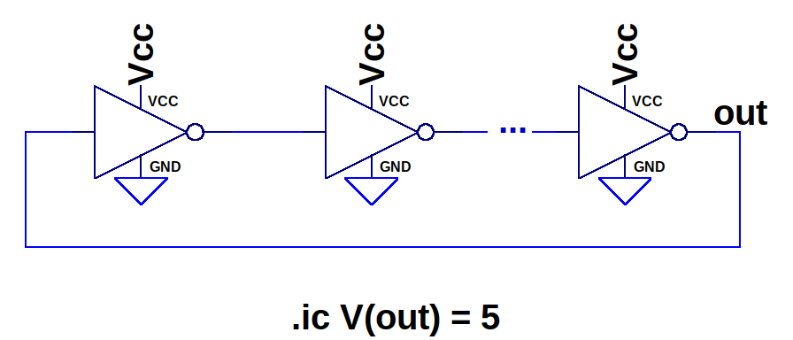
   
    *Figura 1: Esquema general de un oscilador en anillo con N etapas inversoras.*

#### 4.3. Procedimiento Experimental

**Parte 1: Caracterización de la compuerta inversora**
1.  Se aplicó una señal triangular de 1 kHz con amplitud adecuada (e.g., 0-5V) a la entrada de cada compuerta (74LS04 y CD4069). Se utilizó el modo XY del osciloscopio para visualizar la función de transferencia $V_{out}$ vs $V_{in}$ y determinar experimentalmente los parámetros $V_{IH}$, $V_{IL}$, $V_{OH}$, $V_{OL}$.
2.  Con una señal de entrada cuadrada de 1 kHz, se midieron experimentalmente los tiempos de subida ($t_r$), tiempo de bajada ($t_f$), y tiempos de retardo de propagación ($t_{PHL}$ y $t_{PLH}$) para cada dispositivo.

**Parte 2: Parámetros adicionales y aplicación**
1.  Se determinó teóricamente el fan-in y fan-out de cada dispositivo a partir de sus hojas de datos.
2.  Se midió el consumo de corriente de cada dispositivo bajo condiciones estáticas y dinámicas para estimar la potencia.
3.  Se propuso e implementó un circuito de aplicación sencillo (LED indicador) para observar el comportamiento lógico de las compuertas.

**Parte 3: Osciladores en anillo (CMOS)**
1.  Se implementaron dos configuraciones de osciladores en anillo utilizando compuertas NOT del CD4069: una con 3 inversores y otra con 5 inversores.
2.  Se observó y registró la forma de onda y la frecuencia de oscilación generada por cada configuración utilizando el osciloscopio.
3.  Se comparó el desempeño de las dos configuraciones, analizando diferencias en forma de onda, estabilidad y frecuencia.

## 5. Resultados y Discusión

#### 5.1. Comparación de Especificaciones Técnicas (Hojas de Datos)
A partir de las hojas de datos de los integrados CD4069 (CMOS) y 74LS04 (TTL), se compiló la siguiente tabla comparativa de parámetros clave:

| **Especificación**            | **CD4069 (CMOS)**                    | **74LS04 (TTL)**                     |
|--------------------------------|--------------------------------------|---------------------------------------|
| **Tecnología**                 | CMOS (Complementary Metal-Oxide Semiconductor) | TTL (Transistor-Transistor Logic)    |
| **Número de compuertas**       | 6 inversores                         | 6 inversores                          |
| **Tensión de alimentación ($V_{CC}$)** | 3 V a 15 V                          | 4.75 V a 5.25 V (típicamente 5 V)     |
| **Consumo de corriente**       | Muy bajo (µA en reposo)              | Mayor (mA en reposo)                  |
| **Velocidad de operación**     | Más lento que TTL                    | Más rápido que CMOS                   |
| **Corriente de salida**        | Baja (< 1 mA típicamente)            | Alta (hasta 24 mA máx. en salida baja)|
| **Margen de ruido**            | Mayor debido a la alta impedancia    | Menor debido a la baja impedancia     |
| **Tiempo de propagación ($t_{pd}$)**| Típicamente 50-200 ns                | Típicamente 10-25 ns                  |
| **Impedancia de entrada**      | Muy alta                             | Baja                                  |
| **Consumo dinámico**           | Bajo, depende de la frecuencia       | Alto, incluso a frecuencias bajas     |
| **Nivel lógico alto ($V_{OL}$)**   | ~70% de Vcc                          | 2.4 V mín.                            |
| **Nivel lógico bajo ($V_{OH}$)**   | ~30% de Vcc                          | 0.4 V máx.                            |
| **Compatibilidad lógica**      | Compatible con otras familias CMOS   | Compatible con otras familias TTL y algunas CMOS con adaptadores |
| **Aplicaciones típicas**       | Circuitos de bajo consumo, digitales simples | Circuitos de alta velocidad y cargas más pesadas |

#### 5.2. Circuitos Equivalentes y Simulación Preliminar

Se analizaron los circuitos internos equivalentes para un inversor en cada tecnología.

1.  **Inversor TTL (basado en 74LS04):**
    El modelo de la hoja de datos del 74LS04 muestra una estructura con múltiples transistores bipolares, incluyendo un transistor de entrada multiemisor (característico de TTL estándar, aunque LS usa diodos Schottky), divisores de fase y una etapa de salida totem-pole. La simulación del circuito equivalente debe reflejar la no idealidad en los niveles de voltaje de salida.

    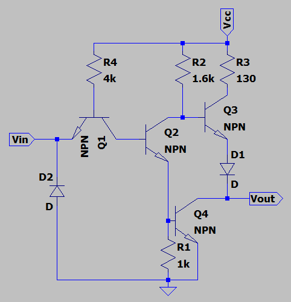
    
    *Figura 2: Circuito equivalente simplificado de una compuerta NOT TTL.*

    
    
    *Figura 3: Simulación de la respuesta del circuito equivalente TTL a una entrada.*

3.  **Inversor CMOS (basado en CD4069):**
    El inversor CMOS utiliza un par complementario de transistores MOSFET (uno NMOS y uno PMOS). En estado estático, uno de los dos transistores está en corte, resultando en un consumo de corriente casi nulo. La salida conmuta prácticamente entre $V_{DD}$ y GND.

    
    
    *Figura 4: Circuito equivalente de una compuerta NOT CMOS.*

    
    
    *Figura 5: Simulación de la respuesta del circuito equivalente CMOS a una entrada.*

Las simulaciones preliminares de estos circuitos equivalentes confirman el comportamiento inversor y las diferencias esperadas en la excursión de la señal de salida, siendo más cercana a los rieles de alimentación en CMOS.

#### 5.3. Análisis de la Compuerta Inversora: Señal Cuadrada 1kHz

##### 5.3.1. Simulaciones

Se montaron los circuitos con los modelos SPICE de los C.I. 74LS04 y CD4069, alimentados a 5V y con una señal de entrada cuadrada de 1 kHz y amplitud 0-5V.

1.  **Inversor TTL 74LS04:**
    El circuito de simulación empleado fue:
    
    
    *Figura 6: Circuito de simulación para el inversor TTL 74LS04.*

    La respuesta entrada-salida obtenida fue:
    
    
    *Figura 7: Formas de onda de entrada y salida para el inversor TTL 74LS04 (Simulación, 1kHz).*

    La función de transferencia $V_{out}$ vs $V_{in}$ obtenida por barrido DC:
    
    
    *Figura 8: Función de transferencia simulada para el inversor TTL 74LS04.*

    De la Figura 8, se estimaron los siguientes parámetros:
    * $V_{IL} \approx 2.479 V$
    * $V_{IH} \approx 2.509 V$
    * $V_{OL} \approx 13.971 mV$
    * $V_{OH} \approx 4.975 V$

3.  **Inversor CMOS CD4069:**
    El circuito de simulación empleado fue:
    
    
    *Figura 9: Circuito de simulación para el inversor CMOS CD4069.*

    La respuesta entrada-salida obtenida fue:
    
    
    *Figura 10: Formas de onda de entrada y salida para el inversor CMOS CD4069 (Simulación, 1kHz).*

    La función de transferencia $V_{out}$ vs $V_{in}$ obtenida por barrido DC:
    
    
    *Figura 11: Función de transferencia simulada para el inversor CMOS CD4069.*

    De la Figura 11, se estimaron los siguientes parámetros:
    * $V_{IL} \approx 2.508 V$
    * $V_{IH} \approx 2.526 V$
    * $V_{OL} \approx 2.524 mV$
    * $V_{OH} \approx 5.0 V$

##### 5.3.2. Resultados Experimentales

1.  **Inversor TTL 74LS04:**
    Se observó una caída de tensión apreciable en el nivel alto de salida y un nivel bajo no nulo, lo que es característico de la tecnología TTL y su etapa de salida totem-pole.
    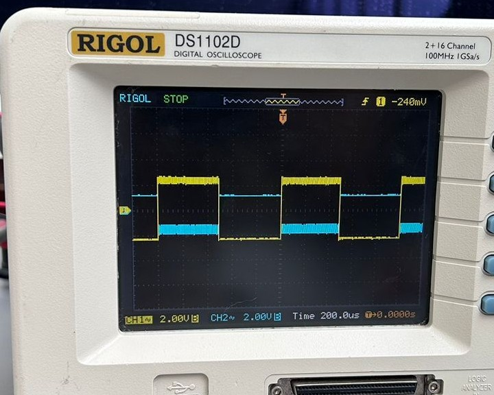
    
    *Figura 12: Respuesta experimental del inversor TTL 74LS04 a una señal cuadrada de 1kHz. Se observa que $V_{OH}$ no alcanza los 5V y $V_{OL}$ es superior a 0V.*

3.  **Inversor CMOS CD4069:**
    En este caso, la caída de tensión en $V_{OH}$ y el valor de $V_{OL}$ fueron significativamente menores en comparación con TTL, acercándose mucho más a los rieles de alimentación $V_{DD}$ y GND. Esto es consistente con el bajo valor de $V_{OL}$ simulado y la alta impedancia de los transistores MOS en estado de corte.
    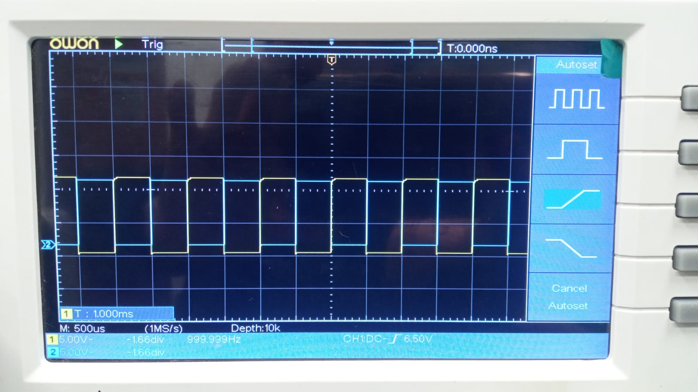
    
    *Figura 13: Respuesta experimental del inversor CMOS CD4069 a una señal cuadrada de 1kHz. Se observa que $V_{OH}$ es cercano a $V_{DD}$ y $V_{OL}$ es cercano a GND.*

#### 5.4. Tiempos de Conmutación (Subida, Bajada y Retardo)

Los tiempos de conmutación son cruciales para determinar la máxima frecuencia de operación de un circuito digital. Se definen $t_r$ (tiempo de subida, 10%-90%), $t_f$ (tiempo de bajada, 90%-10%), $t_{PLH}$ (tiempo de propagación de bajo a alto) y $t_{PHL}$ (tiempo de propagación de alto a bajo), estos últimos medidos al 50% de la amplitud de las señales.
El "tiempo de almacenamiento" mencionado en el borrador se refiere al retardo asociado con la remoción de la carga almacenada en la base de un transistor BJT saturado, lo cual afecta principalmente a $t_{PLH}$ o $t_{PHL}$ en TTL.

##### 5.4.1. Simulaciones

Se utilizaron directivas `.meas` en LTSpice para calcular estos tiempos.
Imagen de las directivas para $t_r$ y $t_f$:
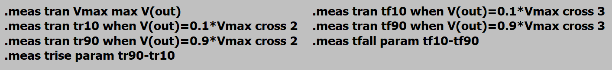

*Figura 14: Ejemplo de directivas de medición en LTSpice para $t_r$ y $t_f$.*

1.  **Inversor TTL 74LS04:**
    * Tiempo de subida ($t_r$): $8.54511 \times 10^{-7} s = 854.51 ns$
    * Tiempo de bajada ($t_f$): $1.53357 \times 10^{-7} s = 153.36 ns$

    Imagen de las directivas para $t_{PHL}$ y $t_{PLH}$:
    
    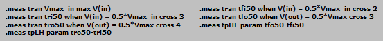
    
    *Figura 15: Ejemplo de directivas de medición en LTSpice para $t_{PHL}$ y $t_{PLH}$.*

    * $t_{PHL} = 450013 ns = 450.013 \mu s$
    * $t_{PLH} = 550017 ns = 550.017 \mu s$
      
3.  **Inversor CMOS CD4069:**
    * Tiempo de subida ($t_r$): $1.79417 \times 10^{-7} s = 179.42 ns$
    * Tiempo de bajada ($t_f$): $2.02093 \times 10^{-7} s = 202.09 ns$
    * $t_{PHL} = 450074 ns = 450.074 \mu s$
    * $t_{PLH} = 550164 ns = 550.164 \mu s$

##### 5.4.2. Resultados Experimentales
Para obtener los datos de tiempos de subida y tiempos de bajada experimentalmente se planteó usar la herramienta de Matlab, sacar un % de los valores que representan las pendientes que corresponden, sin embargo, los datos obtenidos experimentalmente no permitieron lograr esto,  dado que no se obtuvimeron la suficiente cantidad de datos del osciloscopio.

1.  **Inversor TTL 74LS04:**
   
    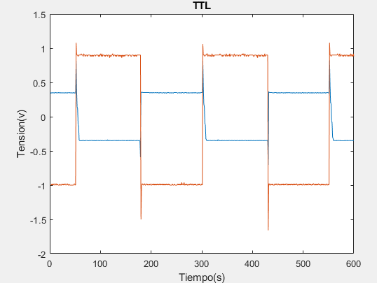
    
    *Figura 16: Captura del osciloscopio para el inversor TTL. Eje X en microsegundos.*

    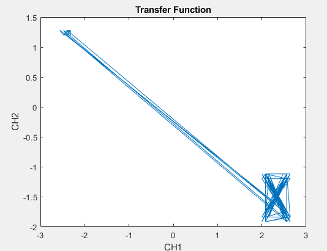
    
    *Figura 17: Función de transferencia experimental para el inversor TTL (Modo XY).*

3.  **Inversor CMOS CD4069:**
   
    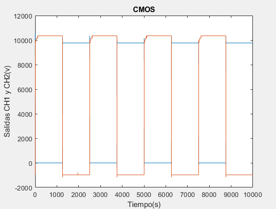
    
    *Figura 18: Captura del osciloscopio para el inversor CMOS. Eje Y en mV/div, eje X en el rango de nanosegundos*

    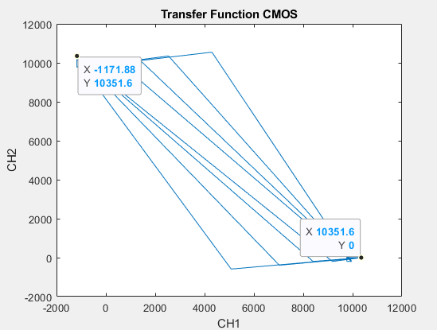

    *Figura 19: Función de transferencia experimental para el inversor CMOS (Modo XY).*

#### 5.5. Capacidad de Carga (Fan-In y Fan-Out)

* **Fan-In:** Para ambas compuertas inversoras (74LS04 y CD4069), el fan-in es de 1, ya que son compuertas de una sola entrada.

* **Fan-Out:** Representa el número de entradas estándar que una salida puede manejar.

    1.  **Inversor TTL 74LS04 (Fan-Out Low):**
        El cálculo se basa en las corrientes máximas que la compuerta puede entregar ($I_{OH}$) o drenar ($I_{OL}$) y las corrientes requeridas por las entradas ($I_{IH}$, $I_{IL}$). Típicamente, el fan-out en TTL está limitado por la capacidad de drenar corriente en estado bajo ($I_{OL}$).
        Usando los datos del borrador: $FanOut_L = \frac{I_{OLmax}}{I_{ILmax}} = \frac{8 mA}{0.4 mA} = 20$.
        Esto significa que una salida 74LS04 puede manejar hasta 20 entradas 74LS.

    2.  **Inversor CMOS CD4069:**
        Para CMOS, el fan-out DC es teóricamente muy alto debido a las bajísimas corrientes de entrada (<1µA). Sin embargo, en la práctica, el fan-out está limitado por consideraciones dinámicas (capacitancia de carga), ya que una mayor carga capacitiva incrementa los tiempos de propagación y el consumo dinámico.
        El cálculo presentado en el borrador considera corrientes DC: $FanOut_H = \frac{I_{OHmin}}{I_{IHmax}}$.
        Usando los datos: $FanOut_H = \frac{0.88 mA}{10 \mu A} = \frac{0.88 \times 10^{-3} A}{10 \times 10^{-6} A} = 88$.
        Este valor indica una buena capacidad de manejo de corriente DC, pero la velocidad se degradará notablemente al acercarse a este límite con cargas CMOS.

#### 5.6. Determinación del Consumo de Potencia
El consumo de potencia en las compuertas lógicas tiene un componente estático (cuando las entradas y salidas no cambian) y uno dinámico (durante las transiciones).
* **TTL (74LS04):** Presenta un consumo estático significativo debido a la corriente que circula internamente incluso en reposo. El consumo dinámico también contribuye, pero el estático suele ser dominante a bajas frecuencias.
* **CMOS (CD4069):** Tiene un consumo estático prácticamente nulo. El consumo de potencia es mayoritariamente dinámico, dado por $P_D \approx C_L \cdot V_{DD}^2 \cdot f$, donde $C_L$ es la capacitancia de carga total, $V_{DD}$ la tensión de alimentación y $f$ la frecuencia de conmutación.

La imagen proporcionada muestra una medición de potencia:

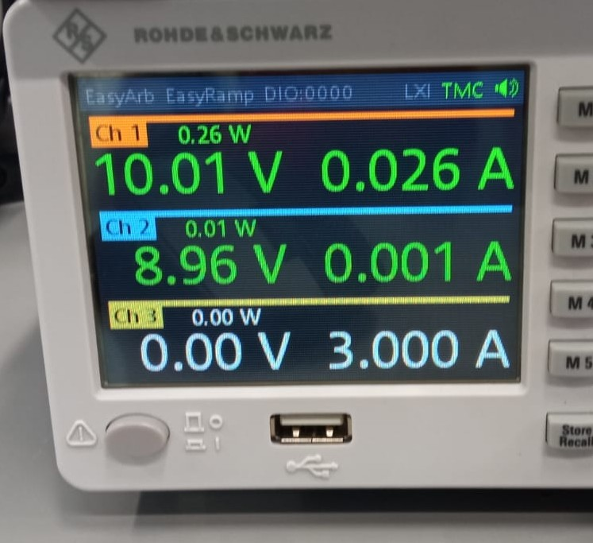

*Figura 20: Medición de potencia en el osciloscopio (Canal 1). Valor indicado: 0.26W.*

#### 5.7. Circuito de Aplicación Propuesto
Se implementó un circuito simple para visualizar la función lógica inversora utilizando un LED. Cuando la entrada de la compuerta está en nivel BAJO (o desconectada, dependiendo de la lógica de entrada flotante de la tecnología), la salida de la compuerta NOT estará en ALTO, encendiendo el LED (si está conectado entre la salida y GND con una resistencia limitadora). Cuando la entrada está en ALTO, la salida estará en BAJO, apagando el LED.

La siguiente figura muestra el montaje del circuito en protoboard, asi como su funcionamiento ante las variaciones de la entrada.
La figura de la izquierda, el pulsador no se encuentra presionado, por tanto, la entrada de la puerta ve 0 V y la salida 5V, encendiendo el LED, por otra parte, en la figura de la derecha, el pulsador esta presionado, de esta manera, la entrada de la puerta ve 5V y la salida esta a 0V por lo que el LED esta apagado.

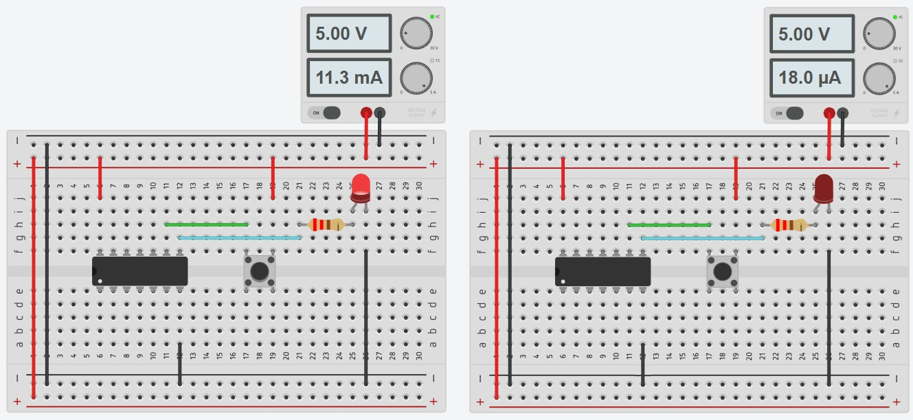

*Figura 21: Circuito de aplicación.*

Este tipo de circuito es útil para una verificación rápida y visual del comportamiento lógico.

#### 5.8. Osciladores en Anillo (CMOS)
Se implementaron dos configuraciones de osciladores en anillo utilizando un número impar de inversores CMOS (CD4069) conectados en cascada, con la salida del último inversor realimentada a la entrada del primero. La frecuencia de oscilación teórica aproximada es $f \approx 1 / (2 \cdot N \cdot t_p)$, donde N es el número de etapas inversoras y $t_p$ es el tiempo de propagación promedio por etapa.

##### 5.8.1. Simulaciones
Se utilizó una condición inicial (`.ic`) de pulso en LTSpice para iniciar la oscilación, ya que en simulación el ruido que inicia la oscilación en la práctica puede no estar presente o requerir tiempos de simulación muy largos.

1.  **Oscilador con 3 compuertas CMOS:**
    Circuito:
    
    
    
    *Figura 22: Circuito de simulación del oscilador en anillo de 3 etapas CMOS.*

    Resultado de la simulación:
    
    
    
    *Figura 23: Simulación del oscilador en anillo de 3 etapas. Frecuencia medida: 1.68 MHz.*

3.  **Oscilador con 5 compuertas CMOS:**
    Circuito:
    
    
    
    *Figura 24: Circuito de simulación del oscilador en anillo de 5 etapas CMOS.*

    Resultado de la simulación:
    
    
    
    *Figura 25: Simulación del oscilador en anillo de 5 etapas. Frecuencia medida: 751 kHz.*

##### 5.8.2. Resultados Experimentales

1.  **Oscilador con 3 compuertas CMOS:**
   
    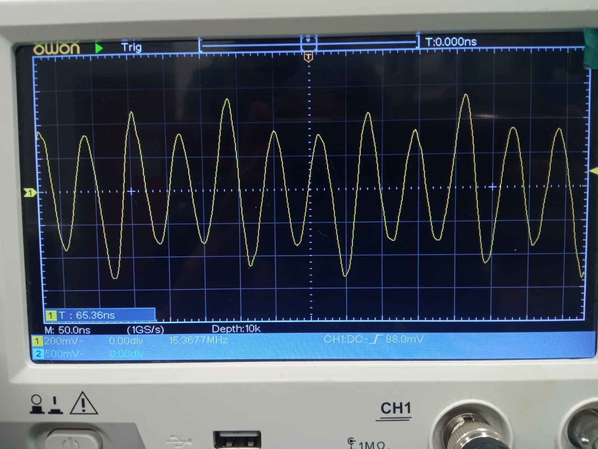
    
    *Figura 26: Resultado experimental del oscilador en anillo de 3 etapas CMOS. Frecuencia y forma de onda observadas.*

3.  **Oscilador con 5 compuertas CMOS:**
   
    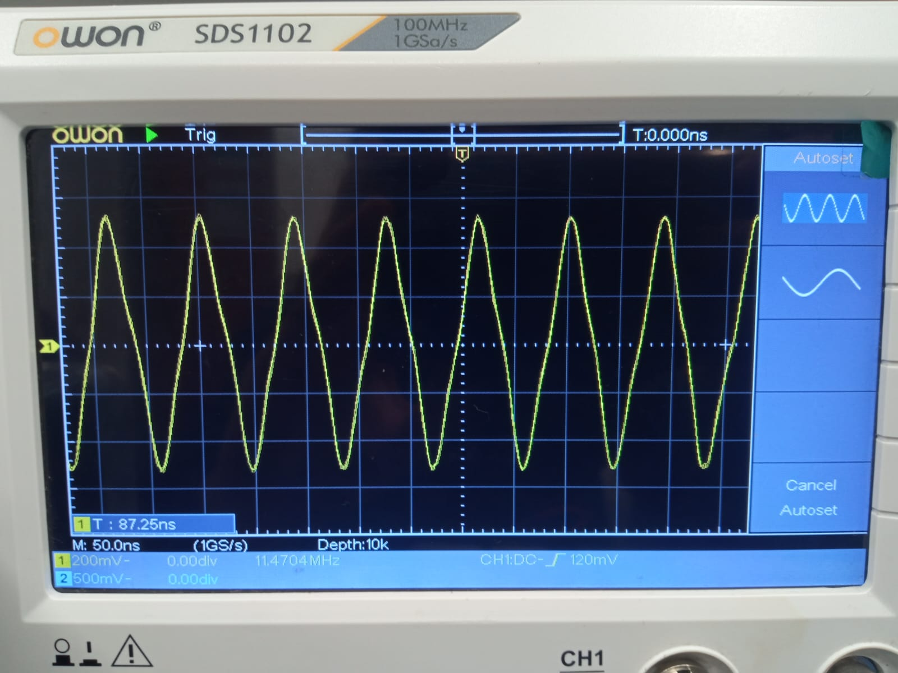
    
    *Figura 27: Resultado experimental del oscilador en anillo de 5 etapas CMOS. Frecuencia y forma de onda observadas.*

### 6. Conclusiones
1.  **Niveles Lógicos y Función de Transferencia:** Experimentalmente y en simulación, se confirmó que las compuertas CMOS (CD4069) presentan niveles de salida ($V_{OH}$, $V_{OL}$) más cercanos a los rieles de alimentación ($V_{DD}$, GND) en comparación con las TTL (74LS04), que mostraron una $V_{OH}$ inferior a $V_{CC}$ y una $V_{OL}$ superior a GND. Esto se traduce en mayores márgenes de ruido para CMOS. Las funciones de transferencia obtenidas reflejaron estas diferencias. (Los valores específicos de $V_{IH}, V_{IL}$ obtenidos en simulación presentaron discrepancias con los valores típicos de datasheet, sugiriendo revisión de modelos SPICE o métodos de extracción).

2.  **Tiempos de Conmutación:** Las hojas de datos indican que la familia 74LS (TTL) es generalmente más rápida (menores $t_p$) que la serie 4000 de CMOS. Las mediciones de simulación de $t_p$, $t_r$ y $t_f$ en la sección 5.4.1 arrojaron valores inusualmente altos para ambas tecnologías, lo que indica la necesidad de revisar esos setups de simulación. Sin embargo, los tiempos de propagación inferidos de las simulaciones de osciladores en anillo para CMOS (99-133 ns) son más consistentes con lo esperado para la serie CD4000. La dificultad en la medición experimental precisa de estos tiempos subraya la necesidad de una adecuada configuración de adquisición de datos.

3.  **Consumo de Potencia:** Aunque la medición cuantitativa de potencia requería más detalles para su interpretación, cualitativamente se espera un consumo estático mucho menor en CMOS que en TTL. El consumo dinámico en CMOS depende de la frecuencia, lo cual es una consideración importante en diseños de alta velocidad y bajo consumo.

4.  **Fan-Out:** Se calculó un fan-out DC considerable para ambas tecnologías, siendo teóricamente mayor para CMOS en DC. No obstante, para CMOS, el fan-out práctico suele estar limitado por la degradación de la velocidad debido al aumento de la carga capacitiva.

5.  **Osciladores en Anillo (CMOS):** La implementación de osciladores en anillo con 3 y 5 etapas CMOS demostró su funcionalidad. Como se esperaba, la frecuencia de oscilación disminuyó al aumentar el número de etapas. Las diferencias entre las frecuencias simuladas y experimentales son comunes y pueden atribuirse a variaciones en los parámetros de los dispositivos reales, capacidades parásitas no modeladas y condiciones de montaje. La forma de onda experimental, menos ideal que la simulada, refleja el comportamiento en un entorno real.

Finalmente, la tecnología CMOS (CD4069) es preferible para aplicaciones de bajo consumo y alta inmunidad al ruido, con un amplio rango de voltaje de operación. La tecnología TTL (74LS04), aunque con mayor consumo estático, puede ofrecer ventajas en velocidad en ciertas subfamilias y es robusta para manejar cargas. La elección entre ellas dependerá de los requisitos específicos de la aplicación. Las simulaciones son una herramienta valiosa para predecir el comportamiento, pero deben ser validadas y contrastadas con resultados experimentales, prestando atención a la precisión de los modelos y la configuración de las mediciones.

### 7. Referencias
* Hoja de datos del 74LS04 (Texas Instruments, u otro fabricante).
* Hoja de datos del CD4069 (Texas Instruments, u otro fabricante).
* Sedra, A. S., & Smith, K. C. (2017). *Microelectronic Circuits*. Oxford University Press.
* Wakerly, J. F. (2006). *Digital Design: Principles and Practices*. Pearson Prentice Hall.

